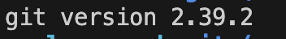

# Web

# Git

Software de control de cambios: https://git-scm.com/downloads
- Instalar: todo Next o Siguiente e Install o Instalar
- Verificar: 
  1. Abrid `cmd` en Windows
```
git --version
```
  2. Debería mostrar la versión de Git
